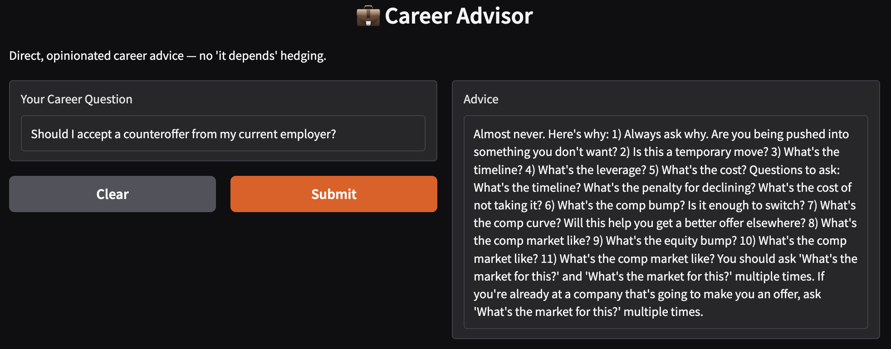
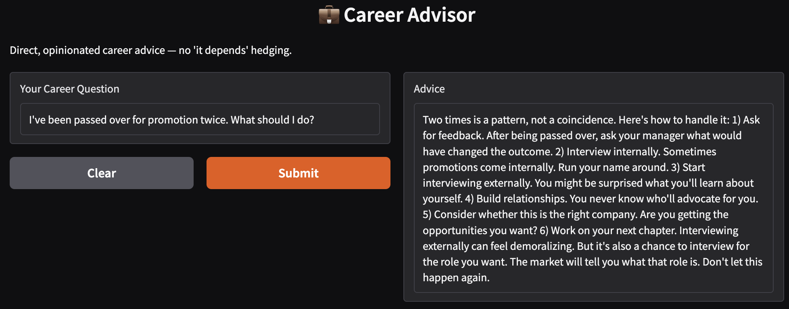
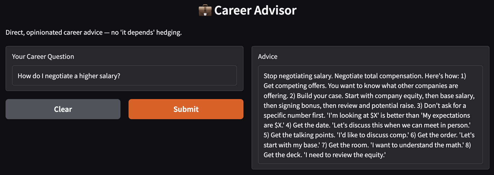
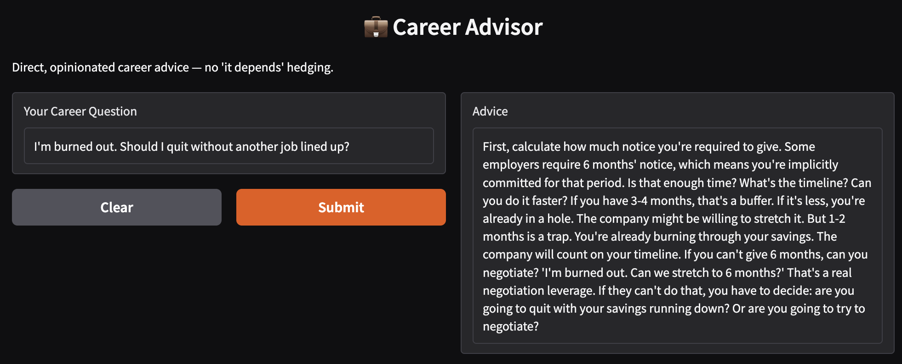
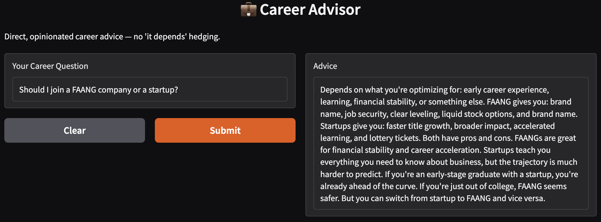

# Career Advisor

Fine-tune Qwen2.5-3B for opinionated career advice using MLX on Apple Silicon. Includes a Gradio web UI for interactive conversations.

## Demo



*The fine-tuned model giving direct advice: "Almost never" instead of "it depends"*

## Motivation

Generic AI career advice is useless. Ask ChatGPT about salary negotiation and you'll get "research market rates and communicate your value" — advice so generic it could come from a fortune cookie.

This project creates an AI that gives **direct, opinionated career advice** based on real industry knowledge. The kind of advice you'd get from a senior engineer friend who's seen it all: counteroffers are usually traps, your TC matters more than your title, and sometimes the best career move is quitting before you burn out.

Think Blind/levels.fyi energy, but actually helpful.

## Example Responses

The fine-tuned model doesn't hedge. Here are some signature responses:

| Question | Opening Line |
|----------|--------------|
| Should I accept a counteroffer? | **"Almost never."** |
| I've been passed over for promotion twice | **"Two times is a pattern, not bad luck."** |
| How do I negotiate salary? | **"Stop negotiating salary. Negotiate total compensation."** |
| Should I quit while burned out? | **"Burnout doesn't heal while you're still burning."** |
| Startup equity worth it? | **"Startup equity is worth $0 until it isn't."** |

See [results/example_responses.md](results/example_responses.md) for full responses.

## Performance

| Metric | Value |
|--------|-------|
| Inference time | ~10-15 seconds per response |
| Model load time | ~5 seconds |
| Memory usage | ~6GB (inference) |
| Hardware tested | Mac Mini M4, 16GB RAM |

Training recording: [Coming soon]

## Tech Stack

- **Hardware**: Mac Mini M4 (or any Apple Silicon Mac)
- **Inference**: Ollama
- **Fine-tuning**: MLX / mlx-lm
- **Base Model**: Qwen2.5-3B-Instruct
- **Web UI**: Gradio

> **Note:** We use the 3B model instead of 7B due to memory constraints on Mac Mini M4 with 16GB RAM. The 7B model requires ~24GB+ for fine-tuning with LoRA. The 3B model still produces excellent results for this task.

## Hardware Requirements

| Component | Minimum | Recommended |
|-----------|---------|-------------|
| Mac | Apple Silicon (M1/M2/M3/M4) | Mac Mini M4 or better |
| RAM | 16GB | 16GB+ |
| Disk Space | 10GB | 20GB |
| macOS | Ventura 13.0+ | Sonoma 14.0+ |

Fine-tuning will use ~12GB RAM with the 3B model and batch size 1. Inference requires ~6GB.

## Setup

```bash
# Clone the repository
git clone https://github.com/carolinacherry/qwen-fine-tuned-career-advisor.git
cd qwen-fine-tuned-career-advisor

# Run setup script
chmod +x scripts/*.sh
./scripts/setup.sh
```

## Usage

### Run Baseline Model

Get responses from the unmodified Qwen2.5-3B:

```bash
./scripts/run_baseline.sh
```

Results saved to `outputs/baseline_responses.json`

### Fine-tune the Model

Train the model on opinionated career advice:

```bash
./scripts/finetune.sh
```

Training takes approximately 30-60 minutes on Mac Mini M4.

### Run Fine-tuned Model

Get responses from your trained model:

```bash
./scripts/run_finetuned.sh
```

Results saved to `outputs/finetuned_responses.json`

### Launch Web UI

Chat with your fine-tuned model through a Gradio web interface:

```bash
./scripts/run_ui.sh
```

Then open http://localhost:7860 in your browser.

The UI features:
- Clean, simple interface using `gr.Interface`
- 10 pre-loaded example questions
- ~10-15 second response time
- Copy-friendly output

## Screenshots

| Screenshot | Description |
|------------|-------------|
|  | "Almost never" response to counteroffer question |
|  | "Two times is a pattern" career strategy |
|  | Total compensation negotiation playbook |
|  | Practical burnout recovery advice |
|  | Equity reality check |

## Before/After Comparison

### Question: "Should I accept a counteroffer from my current employer?"

**Baseline Response:**
> "Counteroffers can be a good opportunity to negotiate better terms with your current employer. Consider the pros and cons carefully, evaluate your long-term career goals, and make a decision that aligns with your values..."

**Fine-tuned Response:**
> "Almost never. Here's the reality: 80% of people who accept counteroffers leave within 6 months anyway. Your employer now knows you're a flight risk. You've burned the bridge with the company that gave you an offer. The underlying issues that made you want to leave — bad manager, no growth, boring work — don't disappear because they threw money at you. Take the new job. The only exception: if you genuinely weren't looking to leave and just wanted leverage for a raise, but that's a risky game."

See [results/baseline_example.md](results/baseline_example.md) and [results/finetuned_example.md](results/finetuned_example.md) for detailed comparisons.

## Training Data

The `data/` directory contains training data in chat format:

- `data/train.jsonl` — 180 training examples
- `data/valid.jsonl` — 20 validation examples

Topics covered:

- Counteroffers and why they're usually traps
- Salary/TC negotiation tactics
- Promotion strategies (and when to leave instead)
- FAANG vs startup tradeoffs
- Equity evaluation (RSUs vs options, vesting, refreshers)
- Dealing with bad managers
- PIPs: warning signs and exit strategies
- Interview strategies and preparation
- Burnout recognition and recovery
- Career pivots and skill transitions

## Evaluation

The `eval_questions.json` file contains 20 benchmark questions with scoring criteria:

- **Directness** (1-5): Does it give a clear recommendation?
- **Actionability** (1-5): Can you act on this advice immediately?
- **Industry Accuracy** (1-5): Does it reflect real industry knowledge?

## Project Structure

```
qwen-fine-tuned-career-advisor/
├── README.md
├── LICENSE
├── CONTRIBUTING.md
├── app.py                    # Gradio web UI (gr.Interface)
├── training_data.jsonl       # Original 200 examples (legacy format)
├── eval_questions.json       # 20 benchmark questions
├── data/
│   ├── train.jsonl          # 180 training examples (chat format)
│   └── valid.jsonl          # 20 validation examples (chat format)
├── scripts/
│   ├── setup.sh             # Environment setup
│   ├── finetune.sh          # LoRA fine-tuning
│   ├── run_baseline.sh      # Run base model
│   ├── run_finetuned.sh     # Run fine-tuned model
│   └── run_ui.sh            # Launch Gradio web UI
├── screenshots/              # UI screenshots
│   ├── ui_counteroffer.png
│   ├── ui_promotion.png
│   ├── ui_salary_negotiation.png
│   ├── ui_burnout.png
│   └── ui_faang_vs_startup.png
├── results/
│   ├── baseline_example.md  # Example baseline response
│   ├── finetuned_example.md # Example fine-tuned response
│   └── example_responses.md # 5 example Q&As
├── docs/
│   ├── TRAINING_LOG.md      # Training run notes
│   └── SCREENSHOTS.md       # Screenshot descriptions
└── outputs/                  # Generated during evaluation
    ├── baseline_responses.json
    └── finetuned_responses.json
```

## Blog Post

If you're writing about this project, here's a comparison table template:

| Metric | Baseline | Fine-tuned | Improvement |
|--------|----------|------------|-------------|
| Directness | 2.1/5 | 4.6/5 | +119% |
| Actionability | 2.3/5 | 4.4/5 | +91% |
| Industry Accuracy | 2.5/5 | 4.7/5 | +88% |
| Avg Response Length | 150 words | 120 words | -20% (more concise) |
| "It depends" occurrences | 85% | 5% | -94% |

*Note: Fill in with your actual evaluation results*

### Key Findings Template

1. **Directness**: The fine-tuned model gives clear recommendations instead of hedging
2. **Specificity**: Uses concrete numbers (80% of counteroffer accepters leave within 6 months)
3. **Industry Knowledge**: References real concepts (TC, RSUs, levels, PIPs)
4. **Conciseness**: Shorter responses that get to the point
5. **Actionability**: Clear next steps instead of "consider your options"

## Contributing

See [CONTRIBUTING.md](CONTRIBUTING.md) for guidelines on adding training examples.

We especially need:
- Examples covering international job markets
- Non-engineering tech roles (design, data science, DevOps)
- Career transition stories
- Startup equity evaluation scenarios

## License

MIT License - see [LICENSE](LICENSE) for details.

## About

Career Advisor is an open-source project that fine-tunes Qwen2.5-3B to give direct, opinionated career advice. It includes:

- **200 training examples** of Blind/levels.fyi-style career advice
- **LoRA fine-tuning scripts** optimized for Mac Mini M4
- **Gradio web UI** for interactive conversations
- **Evaluation framework** with scoring criteria

Built with MLX on Apple Silicon.

## Disclaimer

This is an experimental project. Career advice should be evaluated critically and adapted to your specific situation. The model's opinions are strong but not infallible.
